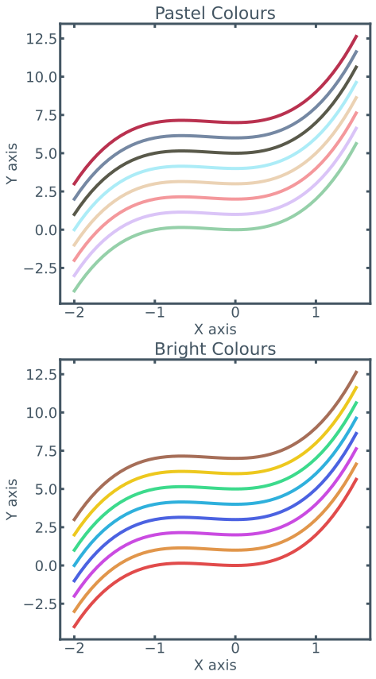

```python
%load_ext autoreload
%autoreload 2

%matplotlib inline
```

## As a first step, import the theme


```python
import numpy as np
import matplotlib.pyplot as plt
from matplotlib_inline import backend_inline

from pr_theme import setup_matplotlib_environment, theme_categorical_bright, theme_categorical_pastel, theme_colours
```


```python
# It's probably best to use SVG so our graphics look crisp.
# However, we won't set this in the theme as doing so is a bit opaque.
backend_inline.set_matplotlib_formats('svg')
```

## We have to call setupl_matplotlib_environment() to apply the settings


```python
setup_matplotlib_environment()
```

## Let's get some basic data to show the plots


```python
# there are two colour themes we can use for categorical data.
# 1. Pastel Colours
# 2. Bright Colours

colour_theme_titles = ["Pastel Colours", "Bright Colours"]
```


```python
def f(x: float, c: float):
    """A simple cubic curve"""
    return x**3 + x**2 + c;
```


```python
# Some x points to evaluate our curve on
x_pts = np.linspace(-2, 1.5, 50)
```


```python
fig, ax = plt.subplots(ncols=1, nrows=2, figsize=(7, 14))

for i, colour_theme in enumerate([theme_categorical_pastel, theme_categorical_bright]):
    
    # Lets a version of a simple curve for each colour in the theme
    data_colours = {colour: [f(x, c) for x in x_pts] for c, colour in enumerate(colour_theme)}
    
    for colour, colour_data in data_colours.items():
        ax[i].plot(x_pts, colour_data, color=colour)
    
    ax[i].set_ylabel("Y axis")
    ax[i].set_xlabel("X axis")
    ax[i].set_title(colour_theme_titles[i])
```


    

    


```python

```


```python

```
