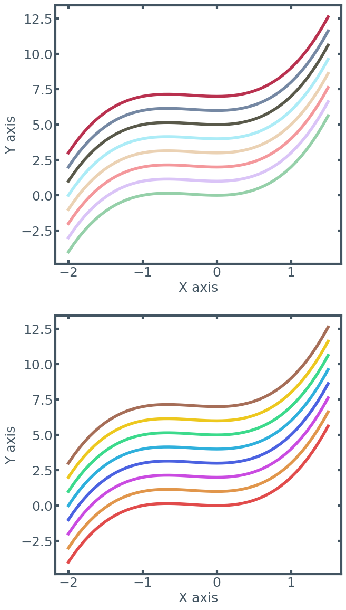

```python
%load_ext autoreload
%autoreload 2
```

    The autoreload extension is already loaded. To reload it, use:
      %reload_ext autoreload


## As a first step, import the theme


```python
import numpy as np
import matplotlib.pyplot as plt

from pr_theme import setup_matplotlib_environment, theme_categorical_bright, theme_categorical_pastel, theme_colours
```

## We have to call setupl_matplotlib_environment() to apply the settings


```python
setup_matplotlib_environment()
```

## Let's get some basic data to show the plots


```python
def f(x: float, c: float):
    return x**3 + x**2 + c;
```


```python
fig, ax = plt.subplots(ncols=1, nrows=2, figsize=(7, 14))

# Lets a version of a simple curve for each colour in the theme
x_pts = np.linspace(-2, 1.5, 50)

for i, colour_theme in enumerate([theme_categorical_pastel, theme_categorical_bright]):
    data_colours = {colour: [f(x, c) for x in x_pts] for c, colour in enumerate(colour_theme)}
    
    for colour, colour_data in data_colours.items():
        ax[i].plot(x_pts, colour_data, color=colour)
    
    ax[i].set_ylabel("Y axis")
    ax[i].set_xlabel("X axis")
```


    

    


```python

```


```python

```
